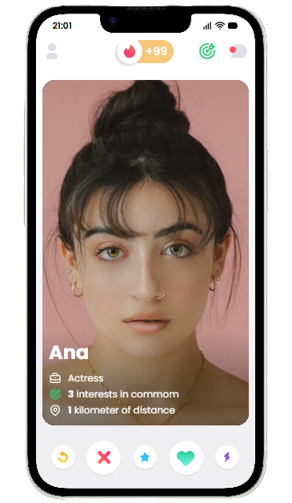

# Swipe App

Prototype that allows users to swipe left or right to interact with cards or items. Fit for creating dating apps, product browsers, or any interactive experience based on swipe gestures.

## Features

- Smooth left and right swipe gestures
- Customizable card design
- Responsive layout for mobile and desktop
- Easy integration into existing projects
- Lightweight and fast performance

## Customization

- You can easily customize:
- Card size and style
- Swipe threshold sensitivity

## Screenshots

Here is a demo of the Swipe App

You can also see it in action 👉 [Live Demo on CodePen](https://codepen.io/giandev10/pen/RNNZgdY)
